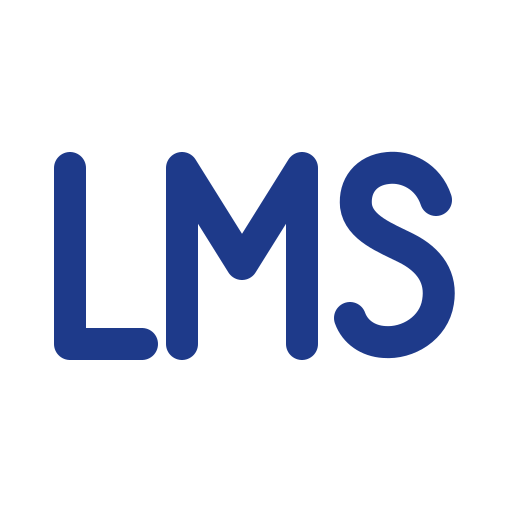

<p align="center">
  
</p>

<h1 align="center">LMS Labs · Assistente</h1>
<p align="center"><em>Aprenda pipelines, modelos e IA conversando.</em></p>

Um chat com IA que tira dúvidas sobre **Engenharia de Dados e Inteligência Artificial** de forma didática, como um professor. Ele é personalizável por **um único arquivo** (`config.yaml`) e publicado de graça no **Hugging Face Spaces**, com deploy automático pelo **GitHub Actions**.

> 🚧 **Em construção — Parte 1, Fase A.** Veja o plano completo em [`SPEC-parte1-cicd-deploy.md`](SPEC-parte1-cicd-deploy.md) e a ideia original em [`docs/IDEIA-parte1.md`](docs/IDEIA-parte1.md).

## Como personalizar

Edite o [`config.yaml`](config.yaml) direto no site do GitHub (ícone de lápis ✏️) e salve com *Commit changes*. Você pode trocar:

- o nome e a descrição;
- as cores e a logo;
- os provedores e modelos de IA (em ordem de preferência);
- as instruções de comportamento;
- as perguntas de exemplo.

Antes de publicar, um **portão de testes** confere se está tudo certo. Se houver erro, a publicação para e o site antigo continua no ar.

## Rodar no seu computador

> Precisa de **Python 3.10 ou mais novo** instalado.

```bash
# 1. Criar um ambiente isolado e instalar as bibliotecas
python -m venv .venv
source .venv/bin/activate        # no Windows: .venv\Scripts\activate
pip install -r requirements-dev.txt

# 2. Configurar suas chaves (o arquivo .env nunca vai para o GitHub)
cp .env.example .env             # no Windows: copy .env.example .env
#    abra o .env e cole sua OPENROUTER_API_KEY

# 3. Abrir o chat (disponível a partir da tarefa 4)
python app.py                    # depois acesse http://localhost:7860
```

## Segurança

As chaves de API **nunca** ficam no código nem no GitHub. No seu computador elas ficam no `.env`, e no Hugging Face ficam em *Settings → Variables and secrets*.

## Roadmap

- **Parte 1:** chat no ar, com CI/CD e deploy automático *(em andamento)*
- **Parte 2:** base de conhecimento com documentos próprios
- **Parte 3:** site próprio com domínio próprio

---
Feito por **Lucas M. Surmani (LMS)**.
